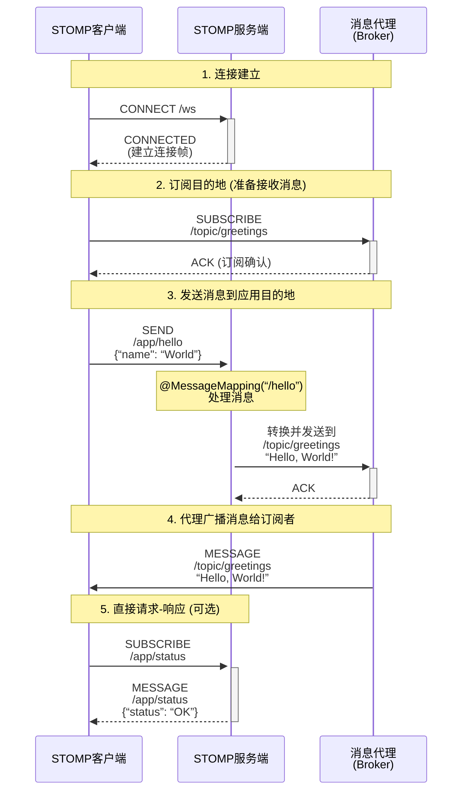

# Spring Stomp 消息使用

## 1. 概述

[STOMP](https://stomp.github.io/stomp-specification-1.2.html#Abstract)（面向简单文本的消息传递协议）最初是为脚本语言（如 Ruby、Python 和 Perl）创建的，用于连接到企业消息代理。它旨在解决常用消息传递模式的最小子集。STOMP 可用于任何可靠的双向流媒体网络协议，例如 TCP 和 WebSocket。尽管 STOMP 是一种面向文本的协议，但消息有效负载可以是文本或二进制的（来源spring官网）

> 可以简单理解为是一种消息协议，与消息中间件（rabbitmq）类似，存在消费者和生产者以及broker（**消息代理**）。在一般的spring程序中，我们的程序即是broker也是生产者或者消费者
>
> Stomp协议是建立在websocket上面，算是对websocket的一种便捷使用

## STOMP 消息发送与接收模型

下图展示了 STOMP 协议中消息从发送到接收的完整流程，特别是 Spring 后端如何处理它们：




------

### 图表关键点解释：

#### 1. **连接建立**

- 客户端通过 WebSocket（或 SockJS）连接到服务端的 STOMP 端点（如 `/ws`）。
- 服务端返回 `CONNECTED` 帧，确认连接已建立，此时 STOMP 会话正式开始。

#### 2. **订阅目的地**

- 客户端向**消息代理** 发送 `SUBSCRIBE` 帧，订阅一个目的地（例如 `/topic/greetings`）。
- 此后，任何发送到该目的地的消息都会被代理推送给这个客户端。

#### 3. **发送消息与应用逻辑处理**

- 这是**最核心**的流程。客户端发送 `SEND` 帧到以 `/app` 为前缀的目的地（例如 `/app/hello`）。
- **关键：** 这个消息首先被 Spring 的 `@MessageMapping` 注解所标识的方法接收和处理。方法内部可以包含任何业务逻辑。
- 处理完毕后，该方法可以通过返回一个值或使用 `SimpMessagingTemplate`，将一个新的消息发送到**消息代理** 上的某个目的地（通常是 `/topic` 或 `/queue`）。

#### 4. **消息广播/推送**

- **消息代理** 负责将接收到的消息（来自服务端）广播给所有订阅了该目的地的客户端。
- 客户端通过接收 `MESSAGE` 帧来获取消息内容。

#### 5. **直接请求-响应**

- 这是一个特殊模式，使用 `@SubscribeMapping`。
- 当客户端订阅以 `/app` 为前缀的目的地时，请求会直接到达控制器方法，该方法可以立即返回一个消息作为“响应”，而无需经过外部的消息代理。这适用于只需要获取一次数据的场景。

## Stomp前端使用

### 0.依赖

前端的类库选择更多一些

可以使用[@stomp/stompjs](https://www.npmjs.com/package/@stomp/stompjs)或者[webstomp-client](https://www.npmjs.com/package/webstomp-client)，前者使用简单，后者分装得更好

stomp.js示例代码：

```shell
npm i @stomp/stompjs
```


```javascript
const stompClient = new StompJs.Client({
    brokerURL: 'ws://localhost:8080/gs-guide-websocket'
});

stompClient.activate();
```

通过sockjs

```javascript
import { Client } from '@stomp/stompjs';
import SockJS from 'sockjs-client';

const client = new Client({
  webSocketFactory: () => new SockJS('http://localhost:15674/stomp'),
});

client.activate();
```


------

webstomp-client示例代码：

```shell
npm install webstomp-client
```


```javascript
var socket = new SockJS("/spring-websocket-portfolio/portfolio");
var stompClient = webstomp.over(socket);

stompClient.connect({}, function(frame) {
}
```

或者，如果您通过 WebSocket（没有 SockJS）进行连接，则可以使用以下代码：

```javascript
var socket = new WebSocket("/spring-websocket-portfolio/portfolio");
var stompClient = Stomp.over(socket);

stompClient.connect({}, function(frame) {
}
```

### 1.连接

```js
stompClient.activate();

//或者webstomp-client
//connect(headers, connectCallback, errorCallback)

stompClient.connect({}, function (frame) {
                            resolve(frame);
                        }, function (error) {
                            reject("STOMP protocol error " + error);
                        });
```

### 2.订阅

```js
//它需要两个必需参数：destination（字符串）和 callback（接收消息的函数），以及用于其他标头的可选标头对象。
stompClient.subscribe('/topic/greetings', (greeting) => {
    showGreeting(JSON.parse(greeting.body).content);
});

//或者webstomp-client
//subscribe(destination, callback, headers={})
stompClient.subscribe('/topic/greetings', function (message) {
                        show(JSON.parse(message.body));
                    });
```

### 3.发送

```js
client.publish({destination: '/topic/general', body: 'Hello world'});

// There is an option to skip the Content-length header
client.publish({
  destination: '/topic/general',
  body: 'Hello world',
  skipContentLengthHeader: true,
});

// Additional headers
client.publish({
  destination: '/topic/general',
  body: 'Hello world',
  headers: {priority: '9'},
});

//或者webstomp-client
//send(destination, body='', headers={})
stompClient.send("/app/trade", JSON.stringify(tradeOrder), {})
```

### 4.关闭

```js
stompClient.deactivate();

//或者webstomp-client
stompClient.disconnect();
```

## Stomp后端使用

### 依赖

stomp部分已经包含在spring-websocket中，我们直接导入就可以了

```xml
<dependency>
    <groupId>org.springframework.boot</groupId>
    <artifactId>spring-boot-starter-websocket</artifactId>
</dependency>
```

### 配置类

```java
@Configuration
@EnableWebSocketMessageBroker
public class WebSocketConfig implements WebSocketMessageBrokerConfigurer {

    @Override
    public void configureMessageBroker(MessageBrokerRegistry config) {
		//使用内置消息代理进行订阅和广播，以及将目标标头以 /topic '或 '/queue 开头的消息路由到代理
		config.enableSimpleBroker("/topic");
		//	目标标头以 /app 开头的 STOMP 消息将路由到 @MessageMapping @Controller 类中的方法
		config.setApplicationDestinationPrefixes("/app");
    }

    @Override
    public void registerStompEndpoints(StompEndpointRegistry registry) {
        //websocket端点
       registry.addEndpoint("/gs-guide-websocket");
    }

}
```

### 注解发送和接收消息

```java
import org.springframework.messaging.handler.annotation.MessageMapping;
import org.springframework.messaging.handler.annotation.SendTo;
import org.springframework.stereotype.Controller;
import org.springframework.web.util.HtmlUtils;

@Controller
public class GreetingController {

    // 客户端发送消息 /app/hello 会执行这个方法
    @MessageMapping("/hello")
    // 将消息发送到这个地址的订阅者
    @SendTo("/topic/greetings")
    public Greeting greeting(HelloMessage message) throws Exception {
       Thread.sleep(1000); // simulated delay
       return new Greeting("Hello, " + HtmlUtils.htmlEscape(message.getName()) + "!");
    }

}
```

### 编码方式发送消息

```java
@Controller
public class GreetingController {

    private SimpMessagingTemplate template;

    @Autowired
    public GreetingController(SimpMessagingTemplate template) {
        this.template = template;
    }

    @RequestMapping(path="/greetings", method=POST)
    public void greet(String greeting) {
        String text = "[" + getTimestamp() + "]:" + greeting;
        this.template.convertAndSend("/topic/greetings", text);
    }

}
```

参考地址

- [spring stomp](https://docs.spring.io/spring-framework/docs/5.2.25.RELEASE/spring-framework-reference/web.html#websocket-stomp)
- [使用 WebSocket 构建交互式 Web 应用程序 ](https://spring.io/guides/gs/messaging-stomp-websocket/)— 入门指南。
- [股票投资组合 ](https://github.com/rstoyanchev/spring-websocket-portfolio)— 一个示例应用程序。
